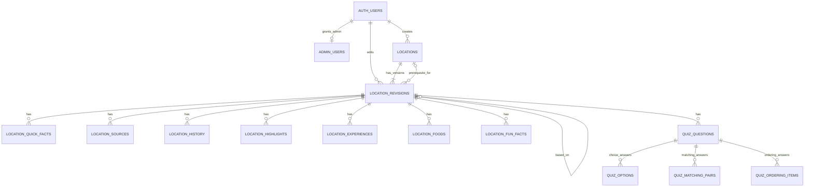
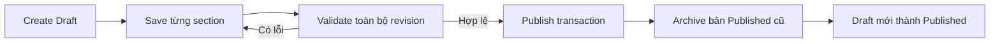

# KoreaQuest Database & Domain Model

> Trạng thái: Tài liệu thảo luận kỹ thuật, chưa phải cam kết triển khai production.
> Nguồn đối chiếu: migration `20260830151124_admin_content_schema.sql`, model/repository Admin, `CONTEXT.md`, ADR và `TEAM_OWNERSHIP.md` tại ngày 2026-09-06.
> Trạng thái cloud: đã xác minh ngày 2026-09-06 bằng `supabase migration list --linked` trên project `KOREAQUEST` (org PHAMVAN+, ref `rsswzbgqapvrutcqasqv`). Migration đã được áp dụng, 14 bảng tồn tại, chưa có dữ liệu.

## 1. Mục tiêu và phạm vi

Database hiện được thiết kế để Quản trị viên tạo, biên tập, kiểm tra, Xuất bản và Lưu trữ nội dung khám phá của một Địa điểm. Nội dung gồm media mở đầu, tổng quan, lịch sử, điểm nổi bật, trải nghiệm văn hóa, ẩm thực, fun facts, quiz và thông tin du lịch.

Phạm vi hiện tại là **Admin Content MVP**:

- Có schema PostgreSQL, RLS, RPC và Flutter Admin Repository.
- Có vòng đời `draft → published → archived` và optimistic locking.
- Có ba nhóm quiz: Check-in, Văn hóa và Quiz tổng kết.
- Chưa có bảng tiến độ cá nhân, quiz attempt, XP ledger, huy hiệu, dấu mộc hoặc từ vựng trong migration này.
- `Explore` và `Journey` vẫn đọc `MockKoreaQuestRepository`; nội dung admin chưa được nối vào trải nghiệm người dùng.
- Supabase project `KOREAQUEST` (org PHAMVAN+, Project Ref `rsswzbgqapvrutcqasqv`) đã được áp dụng migration `20260830151124`. Tuy nhiên file SQL của migration này **chưa được commit vào repository** (chưa có thư mục `supabase/`), nên repo hiện không tự tái tạo được schema cloud.

## 2. Ubiquitous Language

| Thuật ngữ chuẩn | Định nghĩa | Không dùng thay thế |
|---|---|---|
| **Địa điểm (Location)** | Thực thể gốc ổn định đại diện cho một điểm đến văn hóa và sở hữu các Phiên bản nội dung. | Màn chơi, map |
| **Phiên bản nội dung (Location Revision)** | Một snapshot nhất quán của toàn bộ nội dung biên tập thuộc một Địa điểm. | Địa điểm, bản sao |
| **Bản nháp (Draft)** | Phiên bản đang biên tập, được phép thiếu dữ liệu và không hiển thị công khai. | Địa điểm bị khóa |
| **Đã xuất bản (Published)** | Phiên bản hoàn chỉnh đang được phép hiển thị cho Nhà thám hiểm. | Mở khóa |
| **Đã lưu trữ (Archived)** | Phiên bản hoặc Địa điểm được giữ lại nhưng không còn trong danh mục công khai. | Xóa |
| **Điểm nổi bật (Highlight)** | Địa danh hoặc khu vực đáng chú ý bên trong một Địa điểm, không có Hành trình hay tiến độ riêng. | Địa điểm con |
| **Trải nghiệm (Experience)** | Nội dung văn hóa hoặc hoạt động độc đáo mà Nhà thám hiểm có thể nhận biết hoặc tham gia. | Highlight |
| **Câu hỏi (Quiz Question)** | Nhiệm vụ tương tác có đề bài, cách xác định đáp án đúng và giải thích. | Nội dung đọc |
| **Quiz tổng kết (Final Quiz)** | Nhóm đúng 5 Câu hỏi ở đầu chặng Tổng kết, trước kết quả và phần thưởng. | Quiz Check-in, Quiz Văn hóa |
| **Nguồn tham khảo (Source)** | Thông tin truy vết nguồn nội dung hoặc media; không tự chứng minh quyền sử dụng. | Giấy phép |
| **Địa điểm tiên quyết (Prerequisite Location)** | Địa điểm phải hoàn thành trước khi Địa điểm phụ thuộc được mở khóa; mỗi Địa điểm có tối đa một tiên quyết trong MVP. | Trạng thái khóa |
| **Quản trị viên (Admin User)** | Người dùng Supabase Auth có UUID trong `admin_users` và được phép biên tập/xuất bản. | Nhà thám hiểm |

## 3. Tổng quan kiến trúc dữ liệu

`locations` giữ định danh ổn định, slug và trạng thái lưu trữ toàn cục. Nội dung thay đổi nằm trong `location_revisions`, nhờ đó Nhà thám hiểm tiếp tục đọc bản Published trong khi Admin sửa Draft. Partial unique index giới hạn tối đa một `draft` và một `published` cho mỗi Location; nhiều revision cũ có thể cùng ở trạng thái `archived`. Slug không được đổi sau lần Xuất bản đầu tiên.

Các section lặp lại được chuẩn hóa thành bảng con có `revision_id` và `display_order`. Danh sách đơn giản như tag, activities, ingredients hoặc dos/donts dùng PostgreSQL array. Cấu trúc đáp án quiz thay đổi theo `kind`, vì vậy mỗi loại dùng bảng con phù hợp.

Theo ADR 0004, `locked`, `available`, `current` và `completed` là trạng thái theo từng Nhà thám hiểm. Migration hiện tại mới lưu `display_order` và `prerequisite_location_id`; mô hình tiến độ người dùng chưa được triển khai.

## 4. ERD



`AUTH_USERS` là `auth.users` do Supabase Auth quản lý, không được tạo trong migration nội dung.

## 5. Data Dictionary

### 5.1 `admin_users`

| Field | Type | Null | Default | Ý nghĩa / constraint |
|---|---|---:|---|---|
| `user_id` | `uuid` | Không | — | PK; FK `auth.users(id)`; xóa cascade |
| `created_at` | `timestamptz` | Không | `now()` | Thời điểm cấp quyền |
| `created_by` | `uuid` | Có | — | FK `auth.users(id)`; xóa thì set null |

### 5.2 `locations`

| Field | Type | Null | Default | Ý nghĩa / constraint |
|---|---|---:|---|---|
| `id` | `uuid` | Không | `gen_random_uuid()` | PK ổn định của Địa điểm |
| `slug` | `text` | Không | — | Unique; chữ thường không dấu, số và dấu `-` |
| `archived_at` | `timestamptz` | Có | — | Null nghĩa là Location chưa bị Lưu trữ |
| `created_at` | `timestamptz` | Không | `now()` | Thời điểm tạo |
| `created_by` | `uuid` | Có | — | FK `auth.users`; xóa thì set null |

### 5.3 `location_revisions`

| Field | Type | Null | Default | Ý nghĩa / constraint |
|---|---|---:|---|---|
| `id` | `uuid` | Không | `gen_random_uuid()` | PK của Phiên bản nội dung |
| `location_id` | `uuid` | Không | — | FK `locations`; xóa cascade |
| `version_number` | `integer` | Không | — | > 0; unique cùng `location_id` |
| `status` | `location_revision_status` | Không | `draft` | Tối đa một Draft và một Published/Location |
| `base_revision_id` | `uuid` | Có | — | Self FK tới revision nguồn; xóa thì set null |
| `lock_version` | `integer` | Không | `1` | > 0; khóa lạc quan khi lưu |
| `name` | `text` | Không | rỗng | Tên hiển thị; bắt buộc khi publish |
| `korean_name` | `text` | Không | rỗng | Tên tiếng Hàn; bắt buộc khi publish |
| `address` | `text` | Không | rỗng | Địa chỉ; bắt buộc khi publish |
| `city` | `text` | Không | rỗng | Thành phố/tỉnh; bắt buộc khi publish |
| `country` | `text` | Không | rỗng | Quốc gia; bắt buộc khi publish |
| `latitude` | `double precision` | Có | — | -90..90; bắt buộc khi publish |
| `longitude` | `double precision` | Có | — | -180..180; bắt buộc khi publish |
| `location_type` | `text` | Không | rỗng | Loại địa điểm; bắt buộc khi publish |
| `short_description` | `text` | Không | rỗng | Mô tả 20–40 từ khi publish |
| `long_description` | `text` | Không | rỗng | Mô tả 80–120 từ khi publish |
| `cover_image_url` | `text` | Không | rỗng | Ảnh bìa HTTP(S) khi publish |
| `cover_image_credit` | `text` | Không | rỗng | Credit ảnh bìa |
| `cover_image_source_url` | `text` | Không | rỗng | URL nguồn ảnh HTTP(S) |
| `hook_video_url` | `text` | Không | rỗng | URL YouTube mở đầu |
| `hook_video_credit` | `text` | Không | rỗng | Credit/tên kênh |
| `hook_title` | `text` | Không | rỗng | Title/tagline mở đầu |
| `hook_caption` | `text` | Không | rỗng | Caption mở đầu |
| `tags` | `text[]` | Không | `{}` | Ít nhất một tag khi publish |
| `display_order` | `integer` | Không | `0` | >= 0 |
| `prerequisite_location_id` | `uuid` | Có | — | FK `locations`; không tự tham chiếu; delete restrict |
| `opening_hours` | `text` | Không | rỗng | Giờ mở cửa |
| `ticket_price` | `text` | Không | rỗng | Giá vé |
| `transportation` | `text` | Không | rỗng | Cách di chuyển |
| `recommended_duration` | `text` | Không | rỗng | Thời gian tham quan gợi ý |
| `best_time_to_visit` | `text` | Không | rỗng | Thời điểm đẹp nhất |
| `visitor_notes` | `text` | Không | rỗng | Lưu ý tham quan |
| `travel_last_verified_at` | `date` | Có | — | Ngày kiểm chứng; bắt buộc khi publish |
| `created_at` | `timestamptz` | Không | `now()` | Thời điểm tạo revision |
| `created_by` | `uuid` | Có | — | FK `auth.users`; xóa thì set null |
| `updated_at` | `timestamptz` | Không | `now()` | Lần cập nhật gần nhất |
| `updated_by` | `uuid` | Có | — | FK `auth.users`; xóa thì set null |

### 5.4 `location_quick_facts`

| Field | Type | Null | Default | Ý nghĩa / constraint |
|---|---|---:|---|---|
| `id` | `uuid` | Không | UUID tự sinh | PK |
| `revision_id` | `uuid` | Không | — | FK revision; xóa cascade |
| `label` | `text` | Không | rỗng | Nhãn thông tin nhanh |
| `value` | `text` | Không | rỗng | Giá trị hiển thị |
| `display_order` | `integer` | Không | `0` | >= 0; unique trong revision |

### 5.5 `location_highlights`

| Field | Type | Null | Default | Ý nghĩa / constraint |
|---|---|---:|---|---|
| `id` | `uuid` | Không | UUID tự sinh | PK |
| `revision_id` | `uuid` | Không | — | FK revision; xóa cascade |
| `name` | `text` | Không | rỗng | Tên điểm nổi bật |
| `korean_name` | `text` | Không | rỗng | Tên tiếng Hàn |
| `tagline` | `text` | Không | rỗng | Tagline |
| `short_description` | `text` | Không | rỗng | Mô tả 25–40 từ |
| `long_description` | `text` | Không | rỗng | Mô tả 70–110 từ |
| `address` | `text` | Không | rỗng | Vị trí/địa chỉ |
| `activities` | `text[]` | Không | `{}` | Ít nhất một hoạt động khi publish |
| `fun_fact` | `text` | Không | rỗng | Fact của điểm nổi bật |
| `media_kind` | `content_media_kind` | Không | `image` | Ảnh hoặc YouTube |
| `media_url` | `text` | Không | rỗng | URL đúng loại media |
| `media_credit` | `text` | Không | rỗng | Credit media |
| `media_source_url` | `text` | Không | rỗng | URL nguồn HTTP(S) |
| `display_order` | `integer` | Không | `0` | >= 0; unique trong revision |

### 5.6 `location_experiences`

| Field | Type | Null | Default | Ý nghĩa / constraint |
|---|---|---:|---|---|
| `id` | `uuid` | Không | UUID tự sinh | PK |
| `revision_id` | `uuid` | Không | — | FK revision; xóa cascade |
| `name` | `text` | Không | rỗng | Tên trải nghiệm |
| `korean_name` | `text` | Không | rỗng | Tên tiếng Hàn |
| `short_description` | `text` | Không | rỗng | Mô tả 25–40 từ |
| `long_description` | `text` | Không | rỗng | Mô tả 70–120 từ |
| `origin_meaning` | `text` | Không | rỗng | Nguồn gốc/ý nghĩa |
| `recognizable_features` | `text[]` | Không | `{}` | Ít nhất một đặc điểm khi publish |
| `dos` | `text[]` | Không | `{}` | Điều nên làm; tùy chọn |
| `donts` | `text[]` | Không | `{}` | Điều không nên làm; tùy chọn |
| `related_experience` | `text` | Không | rỗng | Trải nghiệm thực tế liên quan |
| `media_kind` | `content_media_kind` | Không | `image` | Ảnh hoặc YouTube |
| `media_url` | `text` | Không | rỗng | URL đúng loại media |
| `media_credit` | `text` | Không | rỗng | Credit media |
| `media_source_url` | `text` | Không | rỗng | URL nguồn HTTP(S) |
| `display_order` | `integer` | Không | `0` | >= 0; unique trong revision |


### 5.7 `location_sources`

| Field | Type | Null | Default | Ý nghĩa / constraint |
|---|---|---:|---|---|
| `id` | `uuid` | Không | UUID tự sinh | PK |
| `revision_id` | `uuid` | Không | — | FK revision; xóa cascade |
| `title` | `text` | Không | rỗng | Tên nguồn |
| `publisher` | `text` | Không | rỗng | Nhà xuất bản/tổ chức |
| `url` | `text` | Không | rỗng | URL HTTP(S) khi publish |
| `accessed_at` | `date` | Có | — | Ngày truy cập; bắt buộc khi publish |
| `display_order` | `integer` | Không | `0` | >= 0; unique trong revision |

### 5.8 `location_history`

| Field | Type | Null | Default | Ý nghĩa / constraint |
|---|---|---:|---|---|
| `id` | `uuid` | Không | UUID tự sinh | PK |
| `revision_id` | `uuid` | Không | — | FK revision; xóa cascade |
| `period_label` | `text` | Không | rỗng | Năm hoặc giai đoạn |
| `title` | `text` | Không | rỗng | Tiêu đề 4–10 từ khi publish |
| `short_description` | `text` | Không | rỗng | Mô tả 20–35 từ |
| `long_description` | `text` | Không | rỗng | Mô tả 70–120 từ |
| `related_people` | `text` | Có | — | Nhân vật liên quan; tùy chọn |
| `media_kind` | `content_media_kind` | Không | `image` | Ảnh hoặc YouTube |
| `media_url` | `text` | Không | rỗng | URL đúng loại media |
| `media_credit` | `text` | Không | rỗng | Credit media |
| `media_source_url` | `text` | Không | rỗng | URL nguồn HTTP(S) |
| `fun_fact` | `text` | Không | rỗng | Fact của mốc lịch sử |
| `display_order` | `integer` | Không | `0` | >= 0; unique trong revision |

### 5.9 `location_foods`

| Field | Type | Null | Default | Ý nghĩa / constraint |
|---|---|---:|---|---|
| `id` | `uuid` | Không | UUID tự sinh | PK |
| `revision_id` | `uuid` | Không | — | FK revision; xóa cascade |
| `name` | `text` | Không | rỗng | Tên món |
| `korean_name` | `text` | Không | rỗng | Tên tiếng Hàn |
| `short_description` | `text` | Không | rỗng | Mô tả 20–30 từ |
| `long_description` | `text` | Không | rỗng | Mô tả 50–80 từ |
| `ingredients` | `text[]` | Không | `{}` | Ít nhất một nguyên liệu |
| `flavors` | `text[]` | Không | `{}` | Ít nhất một hương vị |
| `special_feature` | `text` | Không | rỗng | Điểm đặc biệt |
| `experience_places` | `text[]` | Không | `{}` | Ít nhất một nơi trải nghiệm |
| `image_url` | `text` | Không | rỗng | URL ảnh HTTP(S) |
| `image_credit` | `text` | Không | rỗng | Credit ảnh |
| `image_source_url` | `text` | Không | rỗng | URL nguồn HTTP(S) |
| `display_order` | `integer` | Không | `0` | >= 0; unique trong revision |

### 5.10 `location_fun_facts`

| Field | Type | Null | Default | Ý nghĩa / constraint |
|---|---|---:|---|---|
| `id` | `uuid` | Không | UUID tự sinh | PK |
| `revision_id` | `uuid` | Không | — | FK revision; xóa cascade |
| `fact` | `text` | Không | rỗng | Nội dung 15–35 từ khi publish |
| `display_order` | `integer` | Không | `0` | >= 0; unique trong revision |

### 5.11 `quiz_questions`

| Field | Type | Null | Default | Ý nghĩa / constraint |
|---|---|---:|---|---|
| `id` | `uuid` | Không | UUID tự sinh | PK |
| `revision_id` | `uuid` | Không | — | FK revision; xóa cascade |
| `stage` | `quiz_stage` | Không | — | Check-in, Văn hóa hoặc Final Quiz |
| `kind` | `quiz_question_kind` | Không | — | Kiểu dữ liệu đáp án |
| `prompt` | `text` | Không | rỗng | Đề bài; unique không phân biệt hoa/thường trong revision |
| `explanation` | `text` | Không | rỗng | Giải thích 25–50 từ khi publish |
| `media_kind` | `content_media_kind` | Có | — | Media tùy chọn |
| `media_url` | `text` | Có | — | URL media tùy chọn |
| `media_credit` | `text` | Có | — | Credit media tùy chọn |
| `media_source_url` | `text` | Có | — | URL nguồn media tùy chọn |
| `display_order` | `integer` | Không | `0` | >= 0; unique trong revision |

Bốn field media phải cùng null hoặc cùng có giá trị. Validation publish kiểm tra URL theo `media_kind`.

### 5.12 `quiz_options`

| Field | Type | Null | Default | Ý nghĩa / constraint |
|---|---|---:|---|---|
| `id` | `uuid` | Không | UUID tự sinh | PK |
| `question_id` | `uuid` | Không | — | FK question; xóa cascade |
| `option_text` | `text` | Không | rỗng | Nội dung lựa chọn |
| `is_correct` | `boolean` | Không | `false` | Đánh dấu đáp án đúng |
| `display_order` | `integer` | Không | `0` | >= 0; unique trong question |

### 5.13 `quiz_matching_pairs`

| Field | Type | Null | Default | Ý nghĩa / constraint |
|---|---|---:|---|---|
| `id` | `uuid` | Không | UUID tự sinh | PK |
| `question_id` | `uuid` | Không | — | FK question; xóa cascade |
| `left_text` | `text` | Không | rỗng | Vế trái |
| `right_text` | `text` | Không | rỗng | Vế phải đúng |
| `display_order` | `integer` | Không | `0` | >= 0; unique trong question |

### 5.14 `quiz_ordering_items`

| Field | Type | Null | Default | Ý nghĩa / constraint |
|---|---|---:|---|---|
| `id` | `uuid` | Không | UUID tự sinh | PK |
| `question_id` | `uuid` | Không | — | FK question; xóa cascade |
| `item_text` | `text` | Không | rỗng | Nội dung mục cần sắp xếp |
| `correct_position` | `integer` | Không | — | >= 0; unique trong question |

## 6. Enum

| Enum | Giá trị | Ý nghĩa |
|---|---|---|
| `location_revision_status` | `draft`, `published`, `archived` | Vòng đời Phiên bản nội dung, không phải tiến độ gameplay |
| `content_media_kind` | `image`, `youtube` | Hai loại media URL được Admin hỗ trợ |
| `quiz_stage` | `check_in`, `culture`, `final_quiz` | Nhóm Câu hỏi; `final_quiz` là quiz tổng kết riêng |
| `quiz_question_kind` | `single_choice`, `true_false`, `matching`, `ordering` | Cách lưu và chấm đáp án |

## 7. Cấu trúc nội dung Địa điểm

Luồng nội dung biên tập:

```text
Media mở đầu → Tổng quan → Lịch sử → Điểm đến
→ Văn hóa/Trải nghiệm → Ẩm thực → Fun Facts
→ Quiz → Thông tin du lịch
```

Điều kiện số lượng khi publish:

| Section | Điều kiện |
|---|---:|
| Thông tin nhanh | Tối thiểu 3 |
| Nguồn tham khảo | Tối thiểu 1 |
| Mốc lịch sử | Tối thiểu 4 |
| Điểm nổi bật | Tối thiểu 4 |
| Trải nghiệm văn hóa | Tối thiểu 3 |
| Món ăn | Tối thiểu 3 |
| Fun Facts | Tối thiểu 4 |
| Quiz Check-in | Đúng 5 |
| Quiz Văn hóa | Đúng 5 |
| Quiz tổng kết | Đúng 5 |

Ngoài số lượng, database kiểm tra trường bắt buộc, độ dài mô tả, URL, credit, nguồn, ngày kiểm chứng du lịch, tọa độ và tính hợp lệ của Địa điểm tiên quyết. Draft luôn được phép lưu khi chưa đủ điều kiện publish.

## 8. Quiz Model

| Kind | Bảng đáp án | Quy tắc publish |
|---|---|---|
| `single_choice` | `quiz_options` | 3–4 lựa chọn; đúng chính xác một đáp án; không có lựa chọn rỗng |
| `true_false` | `quiz_options` | Đúng 2 lựa chọn; đúng chính xác một đáp án; không có lựa chọn rỗng |
| `matching` | `quiz_matching_pairs` | 3–6 cặp; hai vế không rỗng và không trùng trong từng phía |
| `ordering` | `quiz_ordering_items` | 3–6 mục không rỗng; `correct_position` biểu diễn thứ tự đúng |

Mọi Câu hỏi cần `prompt` và phần giải thích 25–50 từ. Media câu hỏi là tùy chọn, nhưng nếu đã khai báo thì loại, URL, credit và URL nguồn phải đầy đủ.

`quiz_options.is_correct`, cặp matching và vị trí ordering hiện có thể được public đọc cùng revision Published. Điều này thuận tiện cho client MVP nhưng làm lộ đáp án nếu người dùng truy vấn API trực tiếp; nhóm cần quyết định có chuyển chấm điểm sang RPC/server hay không.

## 9. Media và nguồn

- Ảnh dùng URL HTTP(S); video dùng domain YouTube hoặc `youtu.be`.
- Ảnh bìa, hook và media bắt buộc của từng section cần credit và URL nguồn.
- Media của Câu hỏi là trường tùy chọn duy nhất trong quiz.
- `location_sources` lưu nguồn cấp revision, gồm title, publisher, URL và ngày truy cập.
- `travel_last_verified_at` cho biết ngày gần nhất Admin kiểm chứng thông tin du lịch.
- Ghi nguồn chỉ hỗ trợ truy vết, không tự xác lập bản quyền hoặc giấy phép sử dụng.

## 10. Workflow Admin



Admin lưu Tổng quan, Du lịch hoặc một section lặp lại qua RPC riêng. Mỗi lần lưu gửi `expected_lock_version`; database khóa row Draft, so sánh phiên khóa và tăng `lock_version` sau khi ghi. Nếu một tab hoặc Admin khác đã lưu trước, request cũ bị từ chối để tránh ghi đè thầm lặng.

Khi sửa Location đã Published, `create_location_draft_from_current` sao chép revision hiện hành và toàn bộ bảng con sang Draft mới. `publish_location_revision` validate lại trên database, đổi bản Published cũ thành Archived rồi đổi Draft thành Published trong cùng transaction.

Archive một Location bị từ chối nếu Location còn Draft hoặc đang là prerequisite của một Location Published khác.

## 11. RPC và helper công khai

| Function | Input | Output | Mục đích và tác động |
|---|---|---|---|
| `is_admin` | — | `boolean` | Kiểm tra `auth.uid()` có trong allowlist |
| `can_read_revision` | `target_revision_id` | `boolean` | Helper RLS: revision Published và Location chưa archived |
| `create_location_draft` | `slug`, `payload` | JSON IDs + lock version | Tạo Location và revision v1 Draft; áp dụng Overview |
| `create_location_draft_from_current` | `location_id` | JSON IDs + lock version | Trả Draft hiện có hoặc clone revision mới nhất |
| `save_location_overview` | revision, expected lock, slug, payload | JSON lock version mới | Lưu overview và thay toàn bộ quick facts |
| `save_location_section` | revision, expected lock, section name, items | JSON lock version mới | Thay nguyên tử một section lặp lại hoặc quiz |
| `save_location_travel` | revision, expected lock, payload | JSON lock version mới | Lưu thông tin du lịch |
| `validate_location_revision` | `revision_id` | `text[]` | Trả danh sách lỗi publish, không đổi trạng thái |
| `publish_location_revision` | revision, expected lock | JSON location/revision/status | Validate và hoán đổi Published trong transaction |
| `archive_location` | `location_id` | `void` | Lưu trữ Location sau khi kiểm tra dependency |
| `admin_list_locations` | — | Bảng summary | Danh sách revision ưu tiên Draft rồi Published |
| `get_admin_location` | `location_id` | JSON document | Nạp Draft cùng toàn bộ section cho editor |

Các RPC ghi dữ liệu là `security definer`, đặt `search_path` rỗng và gọi kiểm tra Admin. Quyền execute chỉ được cấp cho role `authenticated`.

## 12. Authentication, Authorization và RLS

Supabase Auth xác thực người dùng. Đăng nhập thành công chưa đủ quyền quản trị: UUID phải tồn tại trong `public.admin_users`.

| Dữ liệu | Anonymous/Authenticated thường | Admin |
|---|---|---|
| `locations` và `location_revisions` | Chỉ đọc Location chưa archived và revision Published | Đọc toàn bộ qua policy/RPC |
| Các bảng nội dung và quiz | Chỉ đọc row thuộc revision Published | Đọc toàn bộ qua policy/RPC |
| `location_sources` | Không đọc | Đọc qua policy/RPC |
| `admin_users` | Không đọc | Đọc qua policy |
| DML trực tiếp | Không được grant | Không được grant; ghi qua RPC |

Fixture trong `supabase/seed.sql` tạo tài khoản thử nghiệm và chỉ dành cho local. Production phải tạo tài khoản Auth bằng quy trình bảo mật riêng rồi thêm UUID vào `admin_users`; không chạy seed local và không commit secret.

## 13. Trạng thái hiện tại

Kiểm tra ngày 2026-09-06 bằng Supabase CLI (`supabase link` + `supabase migration list --linked` + `supabase inspect db table-stats --linked`).

| Hạng mục | Trạng thái quan sát được |
|---|---|
| Supabase Cloud project | Project `KOREAQUEST`, org PHAMVAN+, ref `rsswzbgqapvrutcqasqv`, region Northeast Asia (Tokyo) |
| Migration trên cloud | **Đã áp dụng** `20260830151124` (2026-08-30 15:11:24 UTC), xuất hiện ở cột Remote của `supabase migration list` |
| Bảng trên cloud | Đủ 14 bảng: `admin_users`, `locations`, `location_revisions`, `location_quick_facts`, `location_sources`, `location_history`, `location_highlights`, `location_experiences`, `location_foods`, `location_fun_facts`, `quiz_questions`, `quiz_options`, `quiz_matching_pairs`, `quiz_ordering_items` |
| Dữ liệu trên cloud | Tất cả bảng 0 row; chưa có Admin nào trong `admin_users` |
| Migration schema trong repo | **Chưa có.** Không tồn tại thư mục `supabase/` trên nhánh `main`; cột Local của `supabase migration list` trống. Cần commit file `supabase/migrations/20260830151124_admin_content_schema.sql` để repo khớp với cloud |
| pgTAP | Có 13 assertion về type, table, RPC, final quiz, word count, Admin và RLS draft (trong working tree local của owner, chưa commit) |
| Flutter Admin | Có model/repository và UI editor trong working tree local của owner, chưa commit |
| Explore/Journey runtime | Vẫn dùng `MockKoreaQuestRepository` |
| Docker/local DB | Chưa chạy migration và pgTAP local |

### Điểm chưa thống nhất giữa tài liệu và implementation

- `TEAM_OWNERSHIP.md` mô tả schema cũ với `location_checkin`, `checkin_questions`, `culture_questions` và trạng thái Location toàn cục; migration mới dùng Location Revision và `quiz_questions` thống nhất.
- ADR 0004 yêu cầu tiến độ theo từng Nhà thám hiểm, nhưng migration chưa có bảng user progress.
- Công thức XP, huy hiệu, dấu mộc và mở khóa đã có trong tài liệu ownership nhưng chưa có write model hoặc RPC chống cộng thưởng lặp.
- Từ vựng là chặng chuẩn của Journey nhưng nằm ngoài Admin Content migration hiện tại.

## 14. Các quyết định đã ghi nhận

1. Giữ Journey chuẩn: Check-in → Văn hóa → Từ vựng → Tổng kết; Final Quiz nằm đầu chặng Tổng kết.
2. UUID là khóa quan hệ ổn định; slug dành cho URL và bất biến sau lần publish đầu tiên.
3. Nội dung Published không sửa trực tiếp; chỉnh sửa qua một Draft versioned.
4. Trạng thái gameplay thuộc từng Nhà thám hiểm, không lưu toàn cục trên Location.
5. Publish được validate và thực hiện trong PostgreSQL RPC transaction, không do Flutter tự đổi trạng thái.

## 15. Các điểm cần nhóm thảo luận

1. Các section có chỉ cần đạt số lượng tối thiểu, hay phải chặn vượt mức gợi ý 3–5, 4–6?
2. `location_sources` nên tiếp tục chỉ Admin đọc hay cần public để hiển thị trích dẫn?
3. Có chấp nhận việc client đọc trực tiếp đáp án quiz, hay phải chấm bằng RPC/server?
4. Ai sở hữu công việc chuyển `Explore` và `Journey` từ mock sang Supabase, và hợp đồng repository sẽ đổi thế nào?
5. Migration tiếp theo có cần cùng lúc tạo user progress, quiz attempts và XP ledger không?
6. Cần lưu audit event riêng cho người publish/archive và hỗ trợ rollback revision như thế nào?
7. Khi một Location là prerequisite, quy trình thay thế hoặc archive dependency nên được Admin xử lý ra sao?
8. Quy trình thêm/xóa Admin production cần approval, audit và nguyên tắc tối thiểu bao nhiêu người?
9. Schema mới có thay thế hoàn toàn các bảng dự kiến trong `TEAM_OWNERSHIP.md`, hay cần adapter/migration tương thích?
10. Vocabulary sẽ dùng cùng `location_revisions` để version đồng bộ hay có aggregate/version riêng?
11. XP có được chốt theo công thức hiện tại: +2 hoàn thành, +8 trả lời đúng, +20 section và +50 Location?
12. Cần policy nào để chống spam request, sửa đồng thời và lộ nguồn/media chưa publish?

## 16. Kế hoạch triển khai đề xuất

### Phase 1 — Review schema

- Ba owner xác nhận glossary, ownership và các điểm chưa thống nhất.
- Chốt schema gameplay còn thiếu trước khi coi database là foundation chung.

### Phase 2 — Kiểm thử local

- Bật Docker Desktop.
- Chạy `supabase start`, `supabase db reset`, `supabase test db`.
- Bổ sung test cho Published read, non-admin write, archive dependency và optimistic lock.

### Phase 3 — Đồng bộ repo với cloud (đang thiếu)

- Migration `20260830151124` đã có trên cloud nhưng chưa có trong repo. Owner commit `supabase/migrations/20260830151124_admin_content_schema.sql`, `supabase/config.toml` và test pgTAP vào `main`.
- Sau khi commit, chạy `supabase link --project-ref rsswzbgqapvrutcqasqv` rồi `supabase migration list --linked` để xác nhận cột Local và Remote khớp nhau.
- Mọi migration tiếp theo phải đi qua repo trước, không chạy SQL trực tiếp trên dashboard.

### Phase 4 — Vận hành Supabase Cloud

- Với migration mới: backup, `supabase db push --dry-run`, rồi chỉ `supabase db push` sau khi PR schema được duyệt.
- Tạo Admin production bằng Auth + allowlist (`admin_users` hiện đang trống), không dùng fixture local.
- Chạy smoke test RLS bằng tài khoản anon, user thường và Admin.

### Phase 5 — Kết nối Flutter

- Tạo read repository Supabase cho Explore/Journey.
- Mapping UUID và slug rõ ràng; không đổi route trước khi thống nhất shared file.
- Giữ feature flag/fallback để rollback trong giai đoạn chuyển đổi.

### Phase 6 — Gameplay và vận hành

- Thiết kế progress/attempt/XP ledger bảo đảm idempotency.
- Kết nối Vocabulary, Summary, badge, stamp và prerequisite unlock.
- Theo dõi lỗi RPC, latency và hành vi publish/archive.

## 17. Checklist review của nhóm

### Domain và nội dung

- [ ] Thuật ngữ Location, Revision, Highlight và Final Quiz không còn mơ hồ.
- [ ] Số lượng, trường bắt buộc và giới hạn từ phù hợp nghiệp vụ.
- [ ] Luồng Journey chuẩn và phạm vi Admin được giữ nguyên.

### Database

- [ ] ERD và foreign key phản ánh đúng migration.
- [ ] Versioning, slug, prerequisite và archive xử lý đủ edge case.
- [ ] Nhóm thống nhất schema tiến độ/XP còn thiếu.

### Security

- [ ] RLS được test cho anon, user thường và Admin.
- [ ] Nhóm chốt cách bảo vệ đáp án quiz.
- [ ] Seed local không được dùng ở production.

### Flutter và triển khai

- [ ] Mapping RPC ↔ Admin Repository chính xác.
- [ ] Có owner và kế hoạch thay mock repository.
- [ ] File migration trong repo khớp với `supabase migration list --linked` trên cloud.
- [ ] Migration local, dry-run và cloud rollout đều có bằng chứng kiểm thử.
- [ ] Ít nhất một thành viên khác review trước khi merge.
