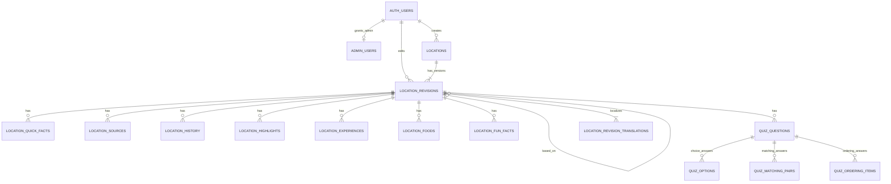
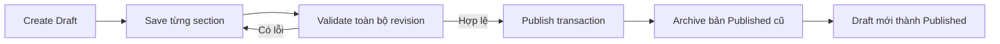

# KoreaQuest Database & Domain Model

> Trạng thái: Tài liệu thảo luận kỹ thuật, chưa phải cam kết triển khai production.
> Nguồn đối chiếu: migrations đến `20261008160000_add_content_image_galleries.sql`, Edge Function `translate-location`, model/repository Admin và Explore, `CONTEXT.md`, ADR và `TEAM_OWNERSHIP.md` tại ngày 2026-10-09.
> Trạng thái cloud: đã xác minh ngày 2026-10-09 trên project `KOREAQUEST` (org PHAMVAN+, ref `rsswzbgqapvrutcqasqv`). Cloud đã áp dụng đến `20261008160000_add_content_image_galleries.sql`; lịch sử Local/Remote khớp và dry-run sau triển khai xác nhận không còn migration chờ áp dụng. OpenAPI có đủ bốn cột gallery cùng RPC Published/Admin mới; smoke test Published xác nhận `media.images` và các trường tương thích ảnh đầu tiên. Edge Function `translate-location` version 4 đang ACTIVE; các secret `GEMINI_API_KEY` và `GEMINI_TRANSLATION_MODEL=gemini-3.1-flash-lite` đã được cấu hình.

## 1. Mục tiêu và phạm vi

Database hiện được thiết kế để Quản trị viên tạo, biên tập, kiểm tra, Xuất bản và Lưu trữ nội dung khám phá của một Địa điểm. Nội dung gồm media mở đầu, tổng quan, lịch sử, điểm nổi bật, trải nghiệm văn hóa, ẩm thực, fun facts, quiz và thông tin du lịch.

Phạm vi hiện tại bao gồm **Admin Content, public read model và progression MVP**:

- Có schema PostgreSQL, RLS, RPC và Flutter Admin Repository.
- Có vòng đời `draft → published → archived` và optimistic locking.
- Có một Quiz tổng kết 10–20 Câu hỏi trong Hành trình chín Chặng.
- Có tiến độ cá nhân, quiz attempt, XP ledger, Huy hiệu, Dấu mộc, lượt xem nội dung và cấu hình gameplay.
- Public read model trả danh sách Published nhưng chỉ trả chi tiết cho Địa điểm `released`.
- Repository chứa đầy đủ migration để tái tạo schema đến `20261008120000_finalize_free_exploration.sql`; cloud đã áp dụng đầy đủ các migration này ngày 2026-10-08.

## 2. Ubiquitous Language

| Thuật ngữ chuẩn | Định nghĩa | Không dùng thay thế |
|---|---|---|
| **Địa điểm (Location)** | Thực thể gốc ổn định đại diện cho một điểm đến văn hóa và sở hữu các Phiên bản nội dung. | Màn chơi, map |
| **Phiên bản nội dung (Location Revision)** | Một snapshot nhất quán của toàn bộ nội dung biên tập thuộc một Địa điểm. | Địa điểm, bản sao |
| **Bản nháp (Draft)** | Phiên bản đang biên tập, được phép thiếu dữ liệu và không hiển thị công khai. | Địa điểm bị khóa |
| **Đã xuất bản (Published)** | Phiên bản hoàn chỉnh có thể xuất hiện trong danh mục; quyền mở chi tiết do Tình trạng ra mắt quyết định. | Đã mở khóa |
| **Đã lưu trữ (Archived)** | Phiên bản hoặc Địa điểm được giữ lại nhưng không còn trong danh mục công khai. | Xóa |
| **Điểm nổi bật (Highlight)** | Địa danh hoặc khu vực đáng chú ý bên trong một Địa điểm, không có Hành trình hay tiến độ riêng. | Địa điểm con |
| **Trải nghiệm (Experience)** | Nội dung văn hóa hoặc hoạt động độc đáo mà Nhà thám hiểm có thể nhận biết hoặc tham gia. | Highlight |
| **Câu hỏi (Quiz Question)** | Nhiệm vụ tương tác có đề bài, cách xác định đáp án đúng và giải thích. | Nội dung đọc |
| **Quiz tổng kết (Final Quiz)** | Nhóm 10–20 Câu hỏi ở Chặng 8 dùng để kiểm tra kiến thức toàn Địa điểm. | Quiz Check-in, Quiz Văn hóa |
| **Nguồn tham khảo (Source)** | Thông tin truy vết nguồn nội dung hoặc media; không tự chứng minh quyền sử dụng. | Giấy phép |
| **Tiến độ Địa điểm (Location Progress)** | Trạng thái `not_started`, `in_progress`, `completed` ghi nhận hoạt động cá nhân; không kiểm soát quyền truy cập. | Trạng thái nội dung |
| **Tình trạng ra mắt (Release Status)** | Trạng thái biên tập `coming_soon` hoặc `released`; chỉ `released` được mở chi tiết. | Tiến độ cá nhân, khóa gameplay |
| **Quản trị viên (Admin User)** | Người dùng Supabase Auth có UUID trong `admin_users` và được phép biên tập/xuất bản. | Nhà thám hiểm |
| **Bản dịch nội dung (Content Translation)** | Lớp chữ hiển thị theo `vi`, `en` hoặc `ko` gắn với một Phiên bản nội dung; không nhân bản media, XP, cấu trúc hay đáp án đúng. | Bản sao Địa điểm |
| **Bản nguồn (Source Content)** | Nội dung tiếng Việt chuẩn để tạo và kiểm tra độ mới của các Bản dịch nội dung. | Bản dịch đã duyệt |
| **Tài khoản khách (Guest User)** | Phiên chơi nhanh chỉ yêu cầu tên hiển thị (`AuthUser.isGuest = true`), không bắt buộc email/mật khẩu; cho phép trải nghiệm nội dung và bảo toàn tiến trình khi nâng cấp. | Người dùng ẩn danh chưa đặt tên |

## 3. Tổng quan kiến trúc dữ liệu

`locations` giữ định danh ổn định, slug và trạng thái lưu trữ toàn cục. Nội dung thay đổi nằm trong `location_revisions`, nhờ đó Nhà thám hiểm tiếp tục đọc bản Published trong khi Admin sửa Draft. Partial unique index giới hạn tối đa một `draft` và một `published` cho mỗi Location; nhiều revision cũ có thể cùng ở trạng thái `archived`. Slug không được đổi sau lần Xuất bản đầu tiên.

Các section lặp lại được chuẩn hóa thành bảng con có `revision_id` và `display_order`. Danh sách đơn giản như tag, activities, ingredients hoặc dos/donts dùng PostgreSQL array. Cấu trúc đáp án quiz thay đổi theo `kind`, vì vậy mỗi loại dùng bảng con phù hợp.

Theo ADR-0012, tiến độ cá nhân chỉ đo hoạt động và không tạo quyền truy cập. Mọi Địa điểm `released` cùng toàn bộ chín Chặng được truy cập trực tiếp; `coming_soon` vẫn hiện trong danh mục nhưng RPC chi tiết không trả nội dung. ADR-0012 thay thế ADR-0004.

## 4. ERD


```mermaid
erDiagram
    AUTH_USERS ||--o| ADMIN_USERS : grants_admin
    AUTH_USERS ||--o{ LOCATIONS : creates
    AUTH_USERS ||--o{ LOCATION_REVISIONS : edits
    LOCATIONS ||--|{ LOCATION_REVISIONS : has_versions
    LOCATION_REVISIONS o|--o{ LOCATION_REVISIONS : based_on
    LOCATION_REVISIONS ||--o{ LOCATION_QUICK_FACTS : has
    LOCATION_REVISIONS ||--o{ LOCATION_SOURCES : has
    LOCATION_REVISIONS ||--o{ LOCATION_HISTORY : has
    LOCATION_REVISIONS ||--o{ LOCATION_HIGHLIGHTS : has
    LOCATION_REVISIONS ||--o{ LOCATION_EXPERIENCES : has
    LOCATION_REVISIONS ||--o{ LOCATION_FOODS : has
    LOCATION_REVISIONS ||--o{ LOCATION_FUN_FACTS : has
    LOCATION_REVISIONS ||--o{ QUIZ_QUESTIONS : has
    LOCATION_REVISIONS ||--|{ LOCATION_REVISION_TRANSLATIONS : localizes
    QUIZ_QUESTIONS ||--o{ QUIZ_OPTIONS : choice_answers
    QUIZ_QUESTIONS ||--o{ QUIZ_MATCHING_PAIRS : matching_answers
    QUIZ_QUESTIONS ||--o{ QUIZ_ORDERING_ITEMS : ordering_answers
```

`AUTH_USERS` là `auth.users` do Supabase Auth quản lý, không được tạo trong migration nội dung.

Bốn bảng `location_history`, `location_highlights`, `location_experiences` và `location_foods` lưu gallery có thứ tự ngay trên từng item bằng `image_gallery jsonb`. Gallery không tạo aggregate hay quan hệ mới: mỗi mảng chứa tối đa 10 ảnh và giữ nguyên thứ tự hiển thị.

## 5. Data Dictionary

### 5.1 `admin_users`

| Field | Type | Null | Default | Ý nghĩa / constraint |
|---|---|---:|---|---|
| `user_id` | `uuid` | Không | — | PK; FK `auth.users(id)`; xóa cascade |
| `created_at` | `timestamptz` | Không | `now()` | Thời điểm cấp quyền |
| `created_by` | `uuid` | Có | — | FK `auth.users(id)`; xóa thì set null |

### 5.2 `locations`

| Field | Type | Null | Default | Ý nghĩa / constraint |
|---|---|---:|---|---|
| `id` | `uuid` | Không | `gen_random_uuid()` | PK ổn định của Địa điểm |
| `slug` | `text` | Không | — | Unique; chữ thường không dấu, số và dấu `-` |
| `archived_at` | `timestamptz` | Có | — | Null nghĩa là Location chưa bị Lưu trữ |
| `created_at` | `timestamptz` | Không | `now()` | Thời điểm tạo |
| `created_by` | `uuid` | Có | — | FK `auth.users`; xóa thì set null |

### 5.3 `location_revisions`

| Field | Type | Null | Default | Ý nghĩa / constraint |
|---|---|---:|---|---|
| `id` | `uuid` | Không | `gen_random_uuid()` | PK của Phiên bản nội dung |
| `location_id` | `uuid` | Không | — | FK `locations`; xóa cascade |
| `version_number` | `integer` | Không | — | > 0; unique cùng `location_id` |
| `status` | `location_revision_status` | Không | `draft` | Tối đa một Draft và một Published/Location |
| `release_status` | `location_release_status` | Không | `coming_soon` | `released` cho phép mở chi tiết; `coming_soon` chỉ hiển thị summary |
| `base_revision_id` | `uuid` | Có | — | Self FK tới revision nguồn; xóa thì set null |
| `lock_version` | `integer` | Không | `1` | > 0; khóa lạc quan khi lưu |
| `name` | `text` | Không | rỗng | Tên hiển thị; bắt buộc khi publish |
| `korean_name` | `text` | Không | rỗng | Tên tiếng Hàn; bắt buộc khi publish |
| `address` | `text` | Không | rỗng | Địa chỉ; bắt buộc khi publish |
| `city` | `text` | Không | rỗng | Thành phố/tỉnh; bắt buộc khi publish |
| `country` | `text` | Không | rỗng | Quốc gia; bắt buộc khi publish |
| `latitude` | `double precision` | Có | — | -90..90; bắt buộc khi publish |
| `longitude` | `double precision` | Có | — | -180..180; bắt buộc khi publish |
| `location_type` | `text` | Không | rỗng | Loại địa điểm; bắt buộc khi publish |
| `short_description` | `text` | Không | rỗng | Mô tả 10–200 từ khi publish |
| `long_description` | `text` | Không | rỗng | Mô tả 10–200 từ khi publish |
| `cover_image_url` | `text` | Không | rỗng | Ảnh bìa HTTP(S) khi publish |
| `cover_image_credit` | `text` | Không | rỗng | Credit ảnh bìa |
| `cover_image_source_url` | `text` | Không | rỗng | URL nguồn ảnh HTTP(S) |
| `hook_video_url` | `text` | Không | rỗng | URL YouTube mở đầu |
| `hook_video_credit` | `text` | Không | rỗng | Credit/tên kênh |
| `hook_title` | `text` | Không | rỗng | Title/tagline mở đầu |
| `hook_caption` | `text` | Không | rỗng | Caption mở đầu |
| `tags` | `text[]` | Không | `{}` | Ít nhất một tag khi publish |
| `display_order` | `integer` | Không | `0` | >= 0 |
| `opening_hours` | `text` | Không | rỗng | Giờ mở cửa |
| `ticket_price` | `text` | Không | rỗng | Giá vé |
| `transportation` | `text` | Không | rỗng | Cách di chuyển |
| `recommended_duration` | `text` | Không | rỗng | Thời gian tham quan gợi ý |
| `best_time_to_visit` | `text` | Không | rỗng | Thời điểm đẹp nhất |
| `visitor_notes` | `text` | Không | rỗng | Lưu ý tham quan |
| `travel_last_verified_at` | `date` | Có | — | Ngày kiểm chứng; bắt buộc khi publish |
| `created_at` | `timestamptz` | Không | `now()` | Thời điểm tạo revision |
| `created_by` | `uuid` | Có | — | FK `auth.users`; xóa thì set null |
| `updated_at` | `timestamptz` | Không | `now()` | Lần cập nhật gần nhất |
| `updated_by` | `uuid` | Có | — | FK `auth.users`; xóa thì set null |

### 5.4 `location_quick_facts`

| Field | Type | Null | Default | Ý nghĩa / constraint |
|---|---|---:|---|---|
| `id` | `uuid` | Không | UUID tự sinh | PK |
| `revision_id` | `uuid` | Không | — | FK revision; xóa cascade |
| `label` | `text` | Không | rỗng | Nhãn thông tin nhanh |
| `value` | `text` | Không | rỗng | Giá trị hiển thị |
| `display_order` | `integer` | Không | `0` | >= 0; unique trong revision |

### 5.5 `location_highlights`

| Field | Type | Null | Default | Ý nghĩa / constraint |
|---|---|---:|---|---|
| `id` | `uuid` | Không | UUID tự sinh | PK |
| `revision_id` | `uuid` | Không | — | FK revision; xóa cascade |
| `name` | `text` | Không | rỗng | Tên điểm nổi bật |
| `korean_name` | `text` | Không | rỗng | Tên tiếng Hàn |
| `tagline` | `text` | Không | rỗng | Tagline |
| `short_description` | `text` | Không | rỗng | Mô tả 10–200 từ |
| `long_description` | `text` | Không | rỗng | Mô tả 10–200 từ |
| `address` | `text` | Không | rỗng | Vị trí/địa chỉ |
| `activities` | `text[]` | Không | `{}` | Ít nhất một hoạt động khi publish |
| `fun_fact` | `text` | Không | rỗng | Fact của điểm nổi bật |
| `media_kind` | `content_media_kind` | Không | `image` | Ảnh hoặc YouTube |
| `media_url` | `text` | Không | rỗng | URL đúng loại media |
| `media_credit` | `text` | Không | rỗng | Credit media |
| `media_source_url` | `text` | Không | rỗng | URL nguồn HTTP(S) |
| `image_gallery` | `jsonb` | Không | `[]` | Tối đa 10 ảnh có thứ tự; mỗi phần tử gồm `url`, `credit`, `source_url`, `alt` dạng chuỗi |
| `display_order` | `integer` | Không | `0` | >= 0; unique trong revision |

### 5.6 `location_experiences`

| Field | Type | Null | Default | Ý nghĩa / constraint |
|---|---|---:|---|---|
| `id` | `uuid` | Không | UUID tự sinh | PK |
| `revision_id` | `uuid` | Không | — | FK revision; xóa cascade |
| `name` | `text` | Không | rỗng | Tên trải nghiệm |
| `korean_name` | `text` | Không | rỗng | Tên tiếng Hàn |
| `short_description` | `text` | Không | rỗng | Mô tả 10–200 từ |
| `long_description` | `text` | Không | rỗng | Mô tả 10–200 từ |
| `origin_meaning` | `text` | Không | rỗng | Nguồn gốc/ý nghĩa |
| `recognizable_features` | `text[]` | Không | `{}` | Ít nhất một đặc điểm khi publish |
| `dos` | `text[]` | Không | `{}` | Điều nên làm; tùy chọn |
| `donts` | `text[]` | Không | `{}` | Điều không nên làm; tùy chọn |
| `related_experience` | `text` | Không | rỗng | Trải nghiệm thực tế liên quan |
| `media_kind` | `content_media_kind` | Không | `image` | Ảnh hoặc YouTube |
| `media_url` | `text` | Không | rỗng | URL đúng loại media |
| `media_credit` | `text` | Không | rỗng | Credit media |
| `media_source_url` | `text` | Không | rỗng | URL nguồn HTTP(S) |
| `image_gallery` | `jsonb` | Không | `[]` | Tối đa 10 ảnh có thứ tự; mỗi phần tử gồm `url`, `credit`, `source_url`, `alt` dạng chuỗi |
| `display_order` | `integer` | Không | `0` | >= 0; unique trong revision |


### 5.7 `location_sources`

| Field | Type | Null | Default | Ý nghĩa / constraint |
|---|---|---:|---|---|
| `id` | `uuid` | Không | UUID tự sinh | PK |
| `revision_id` | `uuid` | Không | — | FK revision; xóa cascade |
| `title` | `text` | Không | rỗng | Tên nguồn |
| `publisher` | `text` | Không | rỗng | Nhà xuất bản/tổ chức |
| `url` | `text` | Không | rỗng | URL HTTP(S) khi publish |
| `accessed_at` | `date` | Có | — | Ngày truy cập; bắt buộc khi publish |
| `display_order` | `integer` | Không | `0` | >= 0; unique trong revision |

### 5.8 `location_history`

| Field | Type | Null | Default | Ý nghĩa / constraint |
|---|---|---:|---|---|
| `id` | `uuid` | Không | UUID tự sinh | PK |
| `revision_id` | `uuid` | Không | — | FK revision; xóa cascade |
| `period_label` | `text` | Không | rỗng | Năm hoặc giai đoạn |
| `title` | `text` | Không | rỗng | Tiêu đề 1–10 từ khi publish |
| `short_description` | `text` | Không | rỗng | Mô tả 10–200 từ |
| `long_description` | `text` | Không | rỗng | Mô tả 10–200 từ |
| `related_people` | `text` | Có | — | Nhân vật liên quan; tùy chọn |
| `media_kind` | `content_media_kind` | Không | `image` | Ảnh hoặc YouTube |
| `media_url` | `text` | Không | rỗng | URL đúng loại media |
| `media_credit` | `text` | Không | rỗng | Credit media |
| `media_source_url` | `text` | Không | rỗng | URL nguồn HTTP(S) |
| `image_gallery` | `jsonb` | Không | `[]` | Tối đa 10 ảnh có thứ tự; mỗi phần tử gồm `url`, `credit`, `source_url`, `alt` dạng chuỗi |
| `fun_fact` | `text` | Không | rỗng | Fact của mốc lịch sử |
| `display_order` | `integer` | Không | `0` | >= 0; unique trong revision |

### 5.9 `location_foods`

| Field | Type | Null | Default | Ý nghĩa / constraint |
|---|---|---:|---|---|
| `id` | `uuid` | Không | UUID tự sinh | PK |
| `revision_id` | `uuid` | Không | — | FK revision; xóa cascade |
| `name` | `text` | Không | rỗng | Tên món |
| `korean_name` | `text` | Không | rỗng | Tên tiếng Hàn |
| `short_description` | `text` | Không | rỗng | Mô tả 10–200 từ |
| `long_description` | `text` | Không | rỗng | Mô tả 10–200 từ |
| `ingredients` | `text[]` | Không | `{}` | Ít nhất một nguyên liệu |
| `flavors` | `text[]` | Không | `{}` | Ít nhất một hương vị |
| `special_feature` | `text` | Không | rỗng | Điểm đặc biệt |
| `experience_places` | `text[]` | Không | `{}` | Ít nhất một nơi trải nghiệm |
| `image_url` | `text` | Không | rỗng | URL ảnh HTTP(S) |
| `image_credit` | `text` | Không | rỗng | Credit ảnh |
| `image_source_url` | `text` | Không | rỗng | URL nguồn HTTP(S) |
| `image_gallery` | `jsonb` | Không | `[]` | Tối đa 10 ảnh có thứ tự; mỗi phần tử gồm `url`, `credit`, `source_url`, `alt` dạng chuỗi |
| `display_order` | `integer` | Không | `0` | >= 0; unique trong revision |

### 5.10 `location_fun_facts`

| Field | Type | Null | Default | Ý nghĩa / constraint |
|---|---|---:|---|---|
| `id` | `uuid` | Không | UUID tự sinh | PK |
| `revision_id` | `uuid` | Không | — | FK revision; xóa cascade |
| `title` | `text` | Có | rỗng | Tiêu đề Fun Fact (tùy chọn) |
| `fact` | `text` | Không | rỗng | Nội dung 10–200 từ khi publish |
| `category` | `text` | Có | rỗng | Danh mục hiển thị (tùy chọn) |
| `icon_name` | `text` | Có | rỗng | Icon trình bày (tùy chọn) |
| `is_visible` | `boolean` | Không | `true` | Cờ hiển thị nội dung |
| `display_order` | `integer` | Không | `0` | >= 0; unique trong revision |

Fun Fact không có `unlock_after_stage`; mọi item hiển thị ngay trong Địa điểm `released`.

### 5.11 `quiz_questions`

| Field | Type | Null | Default | Ý nghĩa / constraint |
|---|---|---:|---|---|
| `id` | `uuid` | Không | UUID tự sinh | PK |
| `revision_id` | `uuid` | Không | — | FK revision; xóa cascade |
| `kind` | `quiz_question_kind` | Không | — | Kiểu dữ liệu đáp án |
| `prompt` | `text` | Không | rỗng | Đề bài; unique không phân biệt hoa/thường trong revision |
| `explanation` | `text` | Không | rỗng | Giải thích 10–200 từ khi publish |
| `media_kind` | `content_media_kind` | Có | — | Media tùy chọn |
| `media_url` | `text` | Có | — | URL media tùy chọn |
| `media_credit` | `text` | Có | — | Credit media tùy chọn |
| `media_source_url` | `text` | Có | — | URL nguồn media tùy chọn |
| `display_order` | `integer` | Không | `0` | >= 0; unique trong revision |

Bốn field media phải cùng null hoặc cùng có giá trị. Validation publish kiểm tra URL theo `media_kind`.

### 5.12 `quiz_options`

| Field | Type | Null | Default | Ý nghĩa / constraint |
|---|---|---:|---|---|
| `id` | `uuid` | Không | UUID tự sinh | PK |
| `question_id` | `uuid` | Không | — | FK question; xóa cascade |
| `option_text` | `text` | Không | rỗng | Nội dung lựa chọn |
| `is_correct` | `boolean` | Không | `false` | Đánh dấu đáp án đúng |
| `display_order` | `integer` | Không | `0` | >= 0; unique trong question |

### 5.13 `quiz_matching_pairs`

| Field | Type | Null | Default | Ý nghĩa / constraint |
|---|---|---:|---|---|
| `id` | `uuid` | Không | UUID tự sinh | PK |
| `question_id` | `uuid` | Không | — | FK question; xóa cascade |
| `left_text` | `text` | Không | rỗng | Vế trái |
| `right_text` | `text` | Không | rỗng | Vế phải đúng |
| `display_order` | `integer` | Không | `0` | >= 0; unique trong question |

### 5.14 `quiz_ordering_items`

| Field | Type | Null | Default | Ý nghĩa / constraint |
|---|---|---:|---|---|
| `id` | `uuid` | Không | UUID tự sinh | PK |
| `question_id` | `uuid` | Không | — | FK question; xóa cascade |
| `item_text` | `text` | Không | rỗng | Nội dung mục cần sắp xếp |
| `correct_position` | `integer` | Không | — | >= 0; unique trong question |

### 5.15 `location_revision_translations`

| Field | Type | Null | Default | Ý nghĩa / constraint |
|---|---|---:|---|---|
| `revision_id` | `uuid` | Không | — | FK tới Phiên bản nội dung; một phần của PK |
| `locale` | `content_locale` | Không | — | `vi`, `en` hoặc `ko`; một phần của PK |
| `status` | `translation_review_status` | Không | `draft` | Trạng thái kiểm duyệt độc lập từng locale |
| `content` | `jsonb` object | Không | `{summary:{}, detail:{}}` | Lớp chữ phủ lên read model tiếng Việt; mảng merge theo vị trí để giữ ID và cấu trúc gốc |
| `source_lock_version` | `integer` | Không | — | Lock version của bản tiếng Việt khi bản dịch được tạo/lưu |
| `created_at`, `updated_at` | `timestamptz` | Không | `now()` | Audit thời gian |
| `created_by`, `updated_by` | `uuid` | Có | — | FK `auth.users`; xóa thì set null |
| `approved_at`, `approved_by` | timestamp/UUID | Có | — | Bắt buộc có thời điểm khi trạng thái là `approved` |

### 5.16 Tiến độ và lượt xem liên quan đến quyền truy cập

| Bảng | Field chính | Quy tắc hiện hành |
|---|---|---|
| `explorer_stage_progress` | `journey_id`, `stage`, `status`, timestamps | `status` chỉ là `not_started`, `in_progress`, `completed`; không dùng để chặn Chặng |
| `explorer_content_views` | `user_id`, `revision_id`, `kind`, `content_id`, `first_viewed_at` | Lưu duy nhất lượt xem nội dung, gồm `kind = 'fun_fact'` |
| `explorer_progress_summary` | XP, streak, correct answer, completed location, content view | Không còn counter `unlocked_fun_fact_count` |
| `explorer_badges` | `user_id`, `achievement_id`, `awarded_at` | Repository bộ sưu tập chỉ trả Huy hiệu đã nhận |
| `explorer_stamps` | `user_id`, `location_id`, `earned_at` | Repository Hộ chiếu chỉ trả Dấu mộc đã nhận; ngày nhận bắt buộc |

`explorer_fun_fact_unlocks` đã bị xóa. Migration `20261008000000_remove_gameplay_unlocks.sql` chuyển lịch sử của bảng này sang `explorer_content_views(kind = 'fun_fact')` trước khi xóa.

## 6. Enum

| Enum | Giá trị | Ý nghĩa |
|---|---|---|
| `location_revision_status` | `draft`, `published`, `archived` | Vòng đời Phiên bản nội dung, không phải tiến độ gameplay |
| `content_media_kind` | `image`, `youtube` | Hai loại media URL được Admin hỗ trợ |
| `quiz_question_kind` | `single_choice`, `true_false`, `matching`, `ordering` | Cách lưu và chấm đáp án |
| `content_locale` | `vi`, `en`, `ko` | Locale nội dung được hỗ trợ trong MVP |
| `translation_review_status` | `draft`, `needs_review`, `approved` | Vòng duyệt Bản dịch nội dung; chỉ `approved` được đọc công khai |
| `location_release_status` | `coming_soon`, `released` | Trạng thái biên tập; chỉ `released` được truy cập chi tiết |
| `stage_progress_status` | `not_started`, `in_progress`, `completed` | Tiến độ Chặng, không kiểm soát quyền truy cập |
| `content_view_kind` | `highlight`, `experience`, `food`, `fun_fact` | Phân loại lượt xem nội dung |
| `achievement_metric` | `completed_locations`, `correct_answers`, `streak_days`, `completed_specific_location`, `challenge_completion`, `content_views` | Tiêu chí Huy hiệu/Thử thách; Fun Fact dùng `content_views` với filter `kind = fun_fact` |

## 7. Cấu trúc nội dung Địa điểm

Luồng nội dung biên tập:

```text
Media mở đầu → Tổng quan → Lịch sử → Điểm đến
→ Văn hóa/Trải nghiệm → Ẩm thực → Fun Facts
→ Quiz → Thông tin du lịch
```

Điều kiện số lượng khi publish:

| Section | Điều kiện |
|---|---:|
| Thông tin nhanh | Tối thiểu 2 |
| Nguồn tham khảo | Tùy chọn; nếu nhập thì dữ liệu phải hợp lệ |
| Mốc lịch sử | Tối thiểu 2 |
| Điểm nổi bật | Tối thiểu 2 |
| Trải nghiệm văn hóa | Tối thiểu 1 |
| Món ăn | Tối thiểu 1 |
| Fun Facts | Tối thiểu 2 |
| Quiz tổng kết | 5–30 câu |

Ngoài số lượng, database kiểm tra trường cốt lõi, độ dài mô tả, media mở đầu, thông tin du lịch và tọa độ. Với các mục lặp (Lịch sử, Điểm đến, Trải nghiệm, Ẩm thực, Fun Fact), metadata bổ sung và media là tùy chọn; tên/nội dung chính và giới hạn từ vẫn bắt buộc. Draft luôn được phép lưu khi chưa đủ điều kiện publish. Gallery của từng item có tối đa 10 phần tử; Draft có thể chứa ảnh chưa hoàn chỉnh, nhưng khi publish mọi ảnh đã thêm phải có URL HTTP(S) hợp lệ. Thứ tự chín Chặng chỉ là hướng dẫn; Quiz, Du lịch và Fun Facts đều có thể mở trực tiếp trong Địa điểm `released`.

## 8. Quiz Model

| Kind | Bảng đáp án | Quy tắc publish |
|---|---|---|
| `single_choice` | `quiz_options` | 2–6 lựa chọn; đúng chính xác một đáp án; không có lựa chọn rỗng |
| `true_false` | `quiz_options` | Đúng 2 lựa chọn; đúng chính xác một đáp án; không có lựa chọn rỗng |
| `matching` | `quiz_matching_pairs` | 2–8 cặp; hai vế không rỗng và không trùng trong từng phía |
| `ordering` | `quiz_ordering_items` | 2–8 mục không rỗng; `correct_position` biểu diễn thứ tự đúng |

Mọi Câu hỏi cần `prompt` và phần giải thích 10–200 từ. Media câu hỏi là tùy chọn.

`validate_location_revision` vẫn trả lỗi quiz theo nhóm dưới dạng `text[]`. Flutter Admin đối chiếu từng lỗi nhóm với Bản nháp vừa lưu để tạo `AdminDiagnostic` có `itemIndex`, số câu hiển thị, prompt rút gọn và lý do cụ thể. Nếu đối chiếu không tìm thấy câu tương ứng, ứng dụng giữ nguyên thông báo database thay vì che mất lỗi.

`quiz_options.is_correct`, cặp matching và vị trí ordering hiện có thể được public đọc cùng revision Published. Điều này thuận tiện cho client MVP nhưng làm lộ đáp án nếu người dùng truy vấn API trực tiếp; nhóm cần quyết định có chuyển chấm điểm sang RPC/server hay không.

## 9. Media và nguồn

- Ảnh dùng URL HTTP(S); video dùng domain YouTube hoặc `youtu.be`.
- Lịch sử, Điểm đến, Trải nghiệm và Ẩm thực dùng `image_gallery` có thứ tự, tối đa 10 ảnh. Public read model trả `media.images`; đồng thời chiếu ảnh đầu tiên vào `media.url`, `media.credit`, `media.source_url`, `media.alt` để tương thích client cũ.
- Lịch sử, Điểm đến và Trải nghiệm vẫn có thể chọn một video YouTube thay cho gallery. Gallery được giữ trong Draft khi đổi chế độ, nhưng public payload chỉ trả loại media đang hoạt động.
- Ảnh bìa và hook cần credit cùng URL nguồn; media trong từng mục Lịch sử, Điểm đến, Trải nghiệm, Ẩm thực và Fun Fact là tùy chọn cho MVP.
- Media của Câu hỏi là trường tùy chọn duy nhất trong quiz.
- `location_sources` lưu nguồn cấp revision, gồm title, publisher, URL và ngày truy cập.
- `travel_last_verified_at` cho biết ngày gần nhất Admin kiểm chứng thông tin du lịch.
- Ghi nguồn chỉ hỗ trợ truy vết, không tự xác lập bản quyền hoặc giấy phép sử dụng.

## 10. Workflow Admin


```mermaid
flowchart LR
    A[Create Draft] --> B[Save từng section]
    B --> C[Validate toàn bộ revision]
    C -->|Có lỗi| B
    C -->|Hợp lệ| D[Publish transaction]
    D --> E[Archive bản Published cũ]
    E --> F[Draft mới thành Published]
```

Admin lưu Tổng quan, Du lịch hoặc một section lặp lại qua RPC riêng. Mỗi lần lưu gửi `expected_lock_version`; database khóa row Draft, so sánh phiên khóa và tăng `lock_version` sau khi ghi. Nếu một tab hoặc Admin khác đã lưu trước, request cũ bị từ chối để tránh ghi đè thầm lặng.

Khi sửa Location đã Published, `create_location_draft_from_current` sao chép revision hiện hành và toàn bộ bảng con sang Draft mới. `publish_location_revision` validate lại trên database, đổi bản Published cũ thành Archived rồi đổi Draft thành Published trong cùng transaction.

Editor gallery cho biết rõ số ảnh hiện có trên giới hạn 10, cho phép thêm, tải lên, xóa và đổi thứ tự từng ảnh cùng metadata. Nguồn dịch chỉ chứa `media.images[index].alt`; URL, credit và URL nguồn là dữ liệu dùng chung. RPC lưu gallery vẫn nhận payload cũ không có `image_gallery` và tự chuẩn hóa ảnh đơn thành gallery một phần tử.

Trong màn hình kiểm tra, lỗi quiz được hiển thị theo đúng số câu và prompt. Nút **Đi tới sửa** chuyển sang Quiz tổng kết, cuộn tới thẻ câu tương ứng và tô viền lỗi; locator dùng chỉ số nội bộ zero-based nhưng nội dung hiển thị cho Admin là one-based.

Archive một Location bị từ chối nếu Location còn Draft. Không còn dependency Địa điểm tiên quyết.

Admin biên tập theo ba tab ngôn ngữ. Tiếng Việt là Bản nguồn. Nút dịch gọi Edge Function `translate-location`; function xác thực Admin, đọc `GEMINI_API_KEY` phía server và trả JSON cùng cấu trúc. Prompt khóa rõ nguồn `vi` và đích `en`/`ko`. Phản hồi được kiểm tra để không chấp nhận JSON chỉ sao chép tiếng Việt; riêng bản Hàn phải có tỷ lệ Hangul phù hợp. Nếu phản hồi đầu tiên sai ngôn ngữ, function tự yêu cầu Gemini dịch lại đúng một lần rồi trả lỗi nếu vẫn không đạt, vì vậy nội dung tiếng Việt không được lưu nhầm vào locale Hàn. Khi `lock_version` bản nguồn thay đổi, trigger chuyển bản Anh/Hàn sang `needs_review`. Chỉ bản dịch có trạng thái `approved` mới được phủ lên read model công khai.

## 11. RPC và helper công khai

| Function | Input | Output | Mục đích và tác động |
|---|---|---|---|
| `is_admin` | — | `boolean` | Kiểm tra `auth.uid()` có trong allowlist |
| `can_read_revision` | `target_revision_id` | `boolean` | Helper RLS: revision Published và Location chưa archived |
| `create_location_draft` | `slug`, `payload` | JSON IDs + lock version | Tạo Location và revision v1 Draft; áp dụng Overview |
| `create_location_draft_from_current` | `location_id` | JSON IDs + lock version | Trả Draft hiện có hoặc clone revision mới nhất |
| `save_location_overview` | revision, expected lock, slug, payload | JSON lock version mới | Lưu overview và thay toàn bộ quick facts |
| `save_location_section` | revision, expected lock, section name, items | JSON lock version mới | Thay nguyên tử một section lặp lại hoặc quiz |
| `save_location_section_with_galleries` | revision, expected lock, section name, items | JSON lock version mới | Bao `save_location_section`, lưu gallery cho bốn section hỗ trợ và nhận cả payload ảnh đơn cũ |
| `save_location_travel` | revision, expected lock, payload | JSON lock version mới | Lưu thông tin du lịch |
| `validate_location_revision` | `revision_id` | `text[]` | Trả danh sách lỗi publish, không đổi trạng thái |
| `validate_location_revision_with_galleries` | `revision_id` | `text[]` | Kết hợp validation cũ với URL và giới hạn gallery; được `publish_location_revision` sử dụng |
| `publish_location_revision` | revision, expected lock | JSON location/revision/status | Validate và hoán đổi Published trong transaction |
| `archive_location` | `location_id` | `void` | Lưu trữ Location sau khi kiểm tra không còn Draft |
| `admin_list_locations` | — | Bảng summary | Danh sách revision ưu tiên Draft rồi Published |
| `get_admin_location` | `location_id` | JSON document | Nạp Draft cùng toàn bộ section cho editor |
| `list_published_locations` | `requested_locale` | JSON summaries | Phủ bản dịch đã duyệt; fallback tiếng Việt khi thiếu. Trả Published chưa archive, gồm `release_status` |
| `get_published_location` | slug, `requested_locale` | JSON document | Trả nội dung theo locale, thêm `media.images` cho gallery và metadata `resolved_locale`/`is_fallback` khi `release_status = released` |
| `submit_quiz_answer` | question, answer, `requested_locale` | JSON result | Chấm bằng dữ liệu gốc và chỉ bản địa hóa phần giải thích |
| `record_content_view` | kind, revision, content | `void` | Ghi lượt xem duy nhất, gồm Fun Fact; không mở khóa nội dung |
| `admin_list_location_translations` | revision | JSON list | Nạp các bản dịch và trạng thái duyệt cho Admin |
| `admin_save_location_translation` | revision, locale, content | JSON translation | Lưu bản Anh/Hàn thành `needs_review` |
| `admin_approve_location_translation` | revision, locale | JSON translation | Duyệt nếu `source_lock_version` vẫn khớp |

Các RPC ghi dữ liệu là `security definer`, đặt `search_path` rỗng và gọi kiểm tra Admin. Quyền execute chỉ được cấp cho role `authenticated`.

## 12. Authentication, Authorization và RLS

Supabase Auth xác thực người dùng. Đăng nhập thành công chưa đủ quyền quản trị: UUID phải tồn tại trong `public.admin_users`.

| Dữ liệu | Anonymous/Authenticated thường | Admin |
|---|---|---|
| `locations` và `location_revisions` | Đọc identity/summary Published; chỉ đọc revision chi tiết khi `release_status = released` | Đọc toàn bộ qua policy/RPC |
| Các bảng nội dung và quiz | Chỉ đọc row thuộc revision Published và `released` | Đọc toàn bộ qua policy/RPC |
| `location_sources` | Không đọc | Đọc qua policy/RPC |
| `location_revision_translations` | Chỉ đọc bản `approved` thuộc revision Published | Đọc mọi trạng thái; ghi qua RPC |
| `admin_users` | Không đọc | Đọc qua policy |
| DML trực tiếp | Không được grant | Không được grant; ghi qua RPC |

Fixture trong `supabase/seed.sql` tạo tài khoản thử nghiệm và chỉ dành cho local. Production phải tạo tài khoản Auth bằng quy trình bảo mật riêng rồi thêm UUID vào `admin_users`; không chạy seed local và không commit secret.

## 13. Trạng thái hiện tại

Cập nhật ngày 2026-10-09:

| Hạng mục | Trạng thái hiện tại |
|---|---|
| Supabase Cloud project | Project `KOREAQUEST`, org PHAMVAN+, ref `rsswzbgqapvrutcqasqv`, region Northeast Asia (Tokyo) |
| Migration trên cloud | **Đã áp dụng đến** `20261008160000_add_content_image_galleries.sql`; lịch sử Local/Remote khớp và dry-run sau triển khai báo database up-to-date ngày 2026-10-09 |
| Gallery ảnh nội dung | Đã triển khai migration, RPC, Admin editor, public carousel và test; OpenAPI Cloud xác nhận bốn cột `image_gallery`, RPC lưu/validate, và smoke test Published trả đúng `media.images` cùng ảnh đầu tương thích |
| Bảng trên cloud | Có đầy đủ các bảng Content, Gameplay và bảng mới `location_revision_translations` |
| Dữ liệu trên cloud | Có 4 Location, 18 Location Revision, 2 Admin; migration đã backfill 18 bản nguồn tiếng Việt trong `location_revision_translations` |
| Nới rule xuất bản | Các migration `20261008094500_simplify_publish_validation.sql` và `20261008111918_lower_publish_word_minimum.sql` đã áp dụng lên cloud ngày 2026-10-08 |
| Edge Function | `translate-location` version 4 ACTIVE từ ngày 2026-10-09; endpoint yêu cầu JWT. Bản deploy khóa rõ nguồn/đích, kiểm tra sai ngôn ngữ và retry tối đa một lần; 2 regression test cho trường hợp locale Hàn đã pass |
| Secret dịch AI | Đã cấu hình `GEMINI_API_KEY` và `GEMINI_TRANSLATION_MODEL=gemini-3.1-flash-lite` trên Supabase; giá trị khóa không lưu trong repository |
| Mô hình truy cập | Cloud và repo cho phép truy cập trực tiếp mọi Địa điểm `released` cùng toàn bộ chín Chặng; `coming_soon` chỉ có summary |
| Tiến độ Chặng | `not_started`, `in_progress`, `completed`; dữ liệu `locked`/`available` cũ được chuyển sang `not_started` |
| Fun Fact | Không còn `unlock_after_stage`, `explorer_fun_fact_unlocks` hoặc counter mở khóa; lịch sử xem dùng `content_views` |
| Huy hiệu/Thử thách | Metric `unlocked_fun_facts` chuyển sang `content_views` với filter `kind = fun_fact` |
| Flutter Admin | Có model/repository và UI editor; lỗi quiz được định vị tới số câu cụ thể và nút sửa cuộn tới đúng thẻ |
| Explore/Journey runtime | Public content dùng Supabase khi có cấu hình và gửi locale `vi`/`en`/`ko`; thiếu bản dịch sẽ fallback tiếng Việt |

### Điểm chưa thống nhất tại snapshot lịch sử (đã superseded)

- `TEAM_OWNERSHIP.md` mô tả schema cũ với `location_checkin`, `checkin_questions`, `culture_questions` và trạng thái Location toàn cục; migration mới dùng Location Revision và `quiz_questions` thống nhất.
- ADR 0004 yêu cầu tiến độ theo từng Nhà thám hiểm, nhưng migration chưa có bảng user progress.
- Công thức XP, huy hiệu, dấu mộc và mở khóa đã có trong tài liệu ownership nhưng chưa có write model hoặc RPC chống cộng thưởng lặp.
- Từ vựng là chặng chuẩn của Journey nhưng nằm ngoài Admin Content migration hiện tại.

## 14. Các quyết định đã ghi nhận

1. Giữ Journey chuẩn: Check-in → Văn hóa → Từ vựng → Tổng kết; Final Quiz nằm đầu chặng Tổng kết.
2. UUID là khóa quan hệ ổn định; slug dành cho URL và bất biến sau lần publish đầu tiên.
3. Nội dung Published không sửa trực tiếp; chỉnh sửa qua một Draft versioned.
4. Tiến độ gameplay thuộc từng Nhà thám hiểm, không lưu toàn cục trên Location và không kiểm soát quyền truy cập.
5. Publish được validate và thực hiện trong PostgreSQL RPC transaction, không do Flutter tự đổi trạng thái.
6. Theo ADR-0012, mọi Địa điểm `released` và mọi Chặng truy cập trực tiếp; `coming_soon` là trạng thái biên tập duy nhất ngăn mở chi tiết. ADR-0012 thay thế ADR-0004.
7. Fun Fact là nội dung thông thường; lịch sử xem dùng `explorer_content_views`, không có mô hình mở khóa riêng.
8. Bộ sưu tập Huy hiệu và Hộ chiếu chỉ trả phần thưởng đã nhận; reset xóa tiến độ, XP và phần thưởng nhưng giữ nguyên `release_status`.
9. Tiếng Việt là Bản nguồn; Anh/Hàn là lớp dịch theo revision. Dữ liệu dùng chung không bị nhân ba.
10. Bản dịch AI luôn là `needs_review`; chỉ bản được Admin duyệt mới hiển thị công khai.
11. Thiếu bản dịch không ẩn nội dung: read model fallback tiếng Việt và trả cờ `is_fallback` để UI thông báo.
12. API key Gemini chỉ đặt trong secret của Edge Function, không đưa vào Flutter Web.
13. Rule publish cho MVP dùng khoảng 10–200 từ cho nội dung mô tả, giảm số section item tối thiểu, cho phép 2–6 đáp án ở câu một lựa chọn và không chặn vì metadata/media tùy chọn ở các mục lặp.
14. RPC validation tiếp tục giữ hợp đồng `text[]`; Flutter Admin làm giàu lỗi quiz bằng dữ liệu Bản nháp đã lưu và `AdminDiagnostic.itemIndex` để định vị chính xác mà không đổi hợp đồng database.
15. Card Lịch sử, Điểm đến, Trải nghiệm và Ẩm thực dùng gallery tối đa 10 ảnh, chỉ hiển thị một ảnh tại một thời điểm. Ba loại đầu có thể dùng một video YouTube thay thế; public payload giữ các trường media ảnh đầu tiên để tương thích ngược, còn bản dịch chỉ lưu alt theo đúng chỉ số ảnh.
16. Edge Function không được lưu phản hồi Gemini chỉ sao chép Bản nguồn. Prompt phải chỉ rõ nguồn/đích; output sai ngôn ngữ được retry tối đa một lần và bị từ chối nếu vẫn không đạt.
17. Tài khoản khách (Guest User): Hỗ trợ phiên khách cục bộ (`AuthUser.isGuest = true`) không bắt buộc email/mật khẩu, chỉ cần tên hiển thị. Khách có thể khám phá và nhận XP; sau khi hoàn thành một Địa điểm (hoặc chặng Tổng kết), ứng dụng kích hoạt hộp thoại vinh danh và gợi ý chuyển đổi sang tài khoản chính thức mà không làm mất tiến trình đã đạt được.

## 15. Các điểm cần nhóm thảo luận

1. Các section có chỉ cần đạt số lượng tối thiểu, hay phải chặn vượt mức gợi ý 3–5, 4–6?
2. `location_sources` nên tiếp tục chỉ Admin đọc hay cần public để hiển thị trích dẫn?
3. Có chấp nhận việc client đọc trực tiếp đáp án quiz, hay phải chấm bằng RPC/server?
4. Ai sở hữu công việc chuyển `Explore` và `Journey` từ mock sang Supabase, và hợp đồng repository sẽ đổi thế nào?
5. Migration tiếp theo có cần cùng lúc tạo user progress, quiz attempts và XP ledger không?
6. Cần lưu audit event riêng cho người publish/archive và hỗ trợ rollback revision như thế nào?
7. Quy trình thêm/xóa Admin production cần approval, audit và nguyên tắc tối thiểu bao nhiêu người?
8. Schema mới có thay thế hoàn toàn các bảng dự kiến trong `TEAM_OWNERSHIP.md`, hay cần adapter/migration tương thích?
9. Vocabulary sẽ dùng cùng `location_revisions` để version đồng bộ hay có aggregate/version riêng?
10. XP có được chốt theo công thức hiện tại: +2 hoàn thành, +8 trả lời đúng, +20 section và +50 Location?
12. Cần policy nào để chống spam request, sửa đồng thời và lộ nguồn/media chưa publish?

## 16. Kế hoạch triển khai đề xuất

### Phase 1 — Review schema

- Ba owner xác nhận glossary, ownership và các điểm chưa thống nhất.
- Chốt schema gameplay còn thiếu trước khi coi database là foundation chung.

### Phase 2 — Kiểm thử không Docker

- Workflow hiện tại không yêu cầu khởi động Docker hoặc Supabase local.
- Chạy đủ `dart format .`, `flutter analyze`, `flutter test`, `flutter build web`; giữ pgTAP trong repo để chạy trên CI/PostgreSQL được quản lý khi có môi trường phù hợp.
- Với database linked, chạy dry-run, áp dụng migration qua CLI, đối chiếu lịch sử Local/Remote rồi smoke test OpenAPI và RPC chỉ đọc.

### Phase 3 — Đồng bộ repo với cloud (đang thiếu)

- Migration `20260830151124` đã có trên cloud nhưng chưa có trong repo. Owner commit `supabase/migrations/20260830151124_admin_content_schema.sql`, `supabase/config.toml` và test pgTAP vào `main`.
- Sau khi commit, chạy `supabase link --project-ref rsswzbgqapvrutcqasqv` rồi `supabase migration list --linked` để xác nhận cột Local và Remote khớp nhau.
- Mọi migration tiếp theo phải đi qua repo trước, không chạy SQL trực tiếp trên dashboard.

### Phase 4 — Vận hành Supabase Cloud

- Với migration mới: backup, `supabase db push --dry-run`, rồi chỉ `supabase db push` sau khi PR schema được duyệt.
- Tạo Admin production bằng Auth + allowlist (`admin_users` hiện đang trống), không dùng fixture local.
- Chạy smoke test RLS bằng tài khoản anon, user thường và Admin.

### Phase 5 — Kết nối Flutter

- Tạo read repository Supabase cho Explore/Journey.
- Mapping UUID và slug rõ ràng; không đổi route trước khi thống nhất shared file.
- Giữ feature flag/fallback để rollback trong giai đoạn chuyển đổi.

### Phase 6 — Gameplay và vận hành

- Thiết kế progress/attempt/XP ledger bảo đảm idempotency.
- Kết nối Vocabulary, Summary, Huy hiệu và Dấu mộc; không thêm lại điều kiện mở khóa gameplay.
- Theo dõi lỗi RPC, latency và hành vi publish/archive.

## 17. Checklist review của nhóm

### Domain và nội dung

- [ ] Thuật ngữ Location, Revision, Highlight và Final Quiz không còn mơ hồ.
- [ ] Số lượng, trường bắt buộc và giới hạn từ phù hợp nghiệp vụ.
- [ ] Luồng Journey chuẩn và phạm vi Admin được giữ nguyên.

### Database

- [ ] ERD và foreign key phản ánh đúng migration.
- [ ] Versioning, slug, `release_status` và archive xử lý đủ edge case.
- [ ] Nhóm thống nhất schema tiến độ/XP còn thiếu.

### Security

- [ ] RLS được test cho anon, user thường và Admin.
- [ ] Nhóm chốt cách bảo vệ đáp án quiz.
- [ ] Seed local không được dùng ở production.

### Flutter và triển khai

- [ ] Mapping RPC ↔ Admin Repository chính xác.
- [ ] Có owner và kế hoạch thay mock repository.
- [ ] File migration trong repo khớp với `supabase migration list --linked` trên cloud.
- [ ] Migration local, dry-run và cloud rollout đều có bằng chứng kiểm thử.
- [ ] Ít nhất một thành viên khác review trước khi merge.
